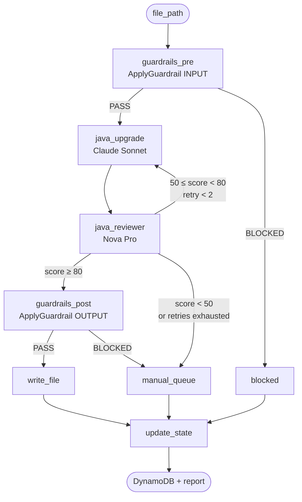

# FORGE

**F**ile-by-file, AI-powered Java migration pipeline. Upgrades legacy Java codebases (`javax.*` → `jakarta.*`, deprecated APIs, Spring Boot versions) using AWS Bedrock, with every file validated by Bedrock Guardrails and cross-reviewed by a second model before it's written.

---

## Architecture

```mermaid
flowchart LR
    subgraph Client["Developer / CI"]
        CLI["migrate.py<br/>LangGraph runner"]
    end

    subgraph AWS["AWS — us-east-1"]
        subgraph Bedrock["Amazon Bedrock"]
            CLAUDE["Claude Sonnet 4.5<br/>transform"]
            NOVA["Amazon Nova Pro<br/>review"]
            GR["Bedrock Guardrail<br/>forge-guardrail-dev"]
        end

        subgraph State["State & checkpoints"]
            DDB1[("DynamoDB<br/>forge-migration-state-dev")]
            DDB2[("DynamoDB<br/>forge-langgraph-checkpoints-dev")]
        end

        subgraph Obs["Observability"]
            CW["CloudWatch<br/>logs + dashboard"]
            SNS["SNS topic<br/>forge-alerts-dev"]
            ALARMS["4 alarms<br/>retry / manual /<br/>stalled / cost"]
        end

        subgraph Phase6["Phase 6+ (not deployed)"]
            SQS["SQS<br/>manual-review"]
            KB["Bedrock KB<br/>+ OpenSearch"]
            SM["SageMaker<br/>TGI endpoint"]
        end
    end

    CLI -->|InvokeModel| CLAUDE
    CLI -->|InvokeModel| NOVA
    CLI -->|ApplyGuardrail| GR
    CLI -->|PutItem / GetItem| DDB1
    CLI -->|checkpoint| DDB2
    CLI -->|PutMetricData / logs| CW
    ALARMS -->|alert| SNS
    SNS -->|email| USER[ancheraja.ai@gmail.com]

    style Phase6 stroke-dasharray: 5 5
```

### Pipeline flow (LangGraph)



---

## Repository layout

```
forge-platform/
├── forge-terraform/       AWS infra as Terraform modules
│   ├── modules/
│   │   ├── foundation/    DynamoDB, Bedrock Guardrail, IAM
│   │   ├── observability/ CloudWatch logs/dashboard/alarms, SNS
│   │   ├── sqs/           Phase 6 — manual review queue
│   │   ├── rag/           Phase 6 — OpenSearch + Bedrock KB
│   │   └── sagemaker/     Future — TGI endpoint
│   └── scripts/
│       ├── bootstrap-state.sh         Creates TF state bucket
│       └── generate-agents-yaml.sh    Generates MVP config
│
├── forge-mvp/             Python pipeline (LangGraph + Bedrock)
│   ├── migrate.py         CLI entrypoint
│   ├── agents.yaml        Resource IDs, model IDs, thresholds
│   ├── forge/
│   │   ├── graph.py       LangGraph wiring
│   │   ├── state.py       TypedDict state + FileStatus
│   │   ├── agents/        guardrails_pre/post, java_upgrade
│   │   ├── review/        java_reviewer
│   │   ├── guardrails/    Bedrock ApplyGuardrail wrapper
│   │   ├── state_store/   DynamoDB checkpointer + state manager
│   │   └── utils/         file scanner, writer, report
│   └── tests/
│
└── prompts/               Phase specifications
    ├── FORGE-Infra-Terraform.md
    └── FORGE-Phase0-MVP.md
```

---

## Quick start

### 1. Deploy Phase 0 infra

```bash
# One-time bootstrap — creates TF state bucket + lock table
bash forge-terraform/scripts/bootstrap-state.sh <aws_account_id>

cd forge-terraform
terraform init \
  -backend-config="bucket=forge-terraform-state-<aws_account_id>" \
  -backend-config="key=forge/dev/terraform.tfstate" \
  -backend-config="region=us-east-1"

cp terraform.tfvars.example terraform.tfvars   # fill in vars
terraform apply -target=module.foundation
terraform apply -target=module.observability
```

### 2. Generate pipeline config

```bash
./forge-terraform/scripts/generate-agents-yaml.sh dev > forge-mvp/agents.yaml
```

### 3. Run the pipeline

```bash
cd forge-mvp
pip install -r requirements.txt

# Dry run against a single file (no writes, no DynamoDB updates)
python migrate.py /path/to/java/project --phase java21 --dry-run --file /path/to/Foo.java

# Full run
python migrate.py /path/to/java/project --phase java21 --output-dir ./migrated
```

---

## Status

- ✅ **Phase 0 infra** — deployed to AWS account `100769305811` / `us-east-1`
- ✅ **Phase 0 pipeline** — scaffolded end-to-end (~1.2k lines), not yet smoke-tested against live AWS
- ⏳ **SNS email confirmation** — pending click in `ancheraja.ai@gmail.com`
- ⏳ **Phase 6+** — SQS, RAG, SageMaker modules exist in Terraform but not deployed

## Cost profile

| Scope | Idle | Active migration |
|---|---|---|
| Phase 0 only (foundation + observability) | ~$5/mo | ~$20–40/mo |
| + `rag` module | +$175/mo (OpenSearch always-on) | same |
| + `sagemaker` (ml.g5.2xlarge) | +$1,093/mo | stop endpoint when idle |

## Specs

- [prompts/FORGE-Infra-Terraform.md](prompts/FORGE-Infra-Terraform.md) — full infrastructure spec
- [prompts/FORGE-Phase0-MVP.md](prompts/FORGE-Phase0-MVP.md) — MVP pipeline spec
- [CLAUDE.md](CLAUDE.md) — working notes for Claude Code sessions
