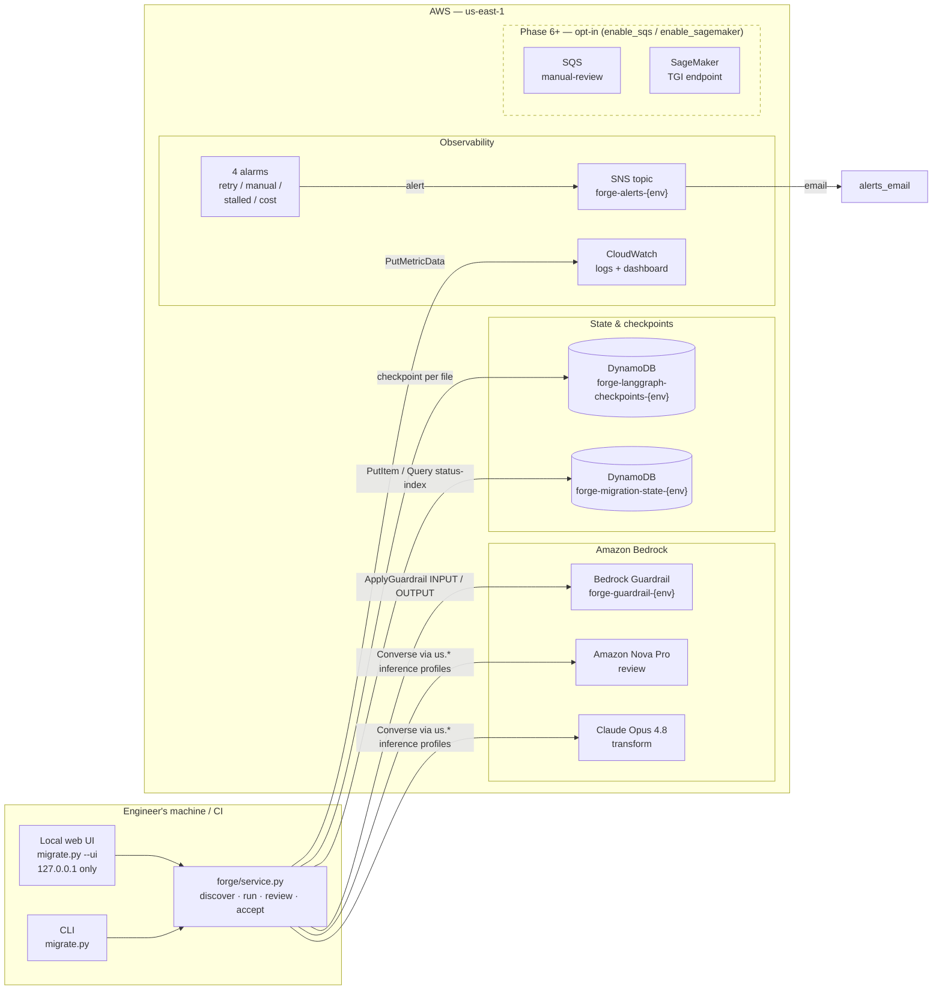
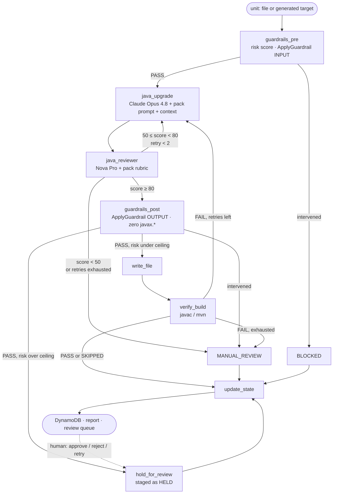

# FORGE

AI-powered **J2EE → Java 21** migration platform. It takes a legacy enterprise application —
Java 8, `javax.*`, Struts 1/2, Spring 5, Spring Security 5, JSP/JSTL, JUnit 4, vendor
descriptors — and moves it to **Java 21 · Jakarta EE 10 · Spring Framework 6 · a WAR on
WebSphere/Open Liberty**, one *pack* (technology transition) at a time. Every file goes through
Bedrock Guardrails, a transform model, a cross-model review, a deterministic risk score and an
optional compile gate before it is written; risky units are held for a human. No Spring Boot.

Drive it from the CLI (`migrate.py`, for CI) or from a local web UI (`migrate.py --ui`) — both
call the same service layer.

---

## Architecture



### Pipeline flow (LangGraph)



---

## Repository layout

```
forge-platform/
├── forge-terraform/       AWS infra as Terraform modules
│   ├── modules/
│   │   ├── foundation/    DynamoDB ×2, Bedrock Guardrail (+ auto-published version), IAM execution role
│   │   ├── observability/ CloudWatch log group / dashboard / 4 alarms, SNS
│   │   ├── sqs/           Phase 6 — manual review queue + DLQ        (enable_sqs)
│   │   └── sagemaker/     Future — TGI endpoint                      (enable_sagemaker)
│   ├── scripts/
│   │   ├── bootstrap-state.sh         Creates the TF state bucket + lock table
│   │   └── generate-agents-yaml.sh    Writes agents.yaml from terraform output
│   └── SPEC.md            The build prompt this directory came from (historical)
│
├── forge-mvp/             Python pipeline (LangGraph + Bedrock)
│   ├── migrate.py         CLI — a printer over forge/service.py; --ui starts the web UI
│   ├── agents.yaml        Resource IDs, model IDs, thresholds, decisions, pricing (generated)
│   ├── forge/
│   │   ├── service.py     The one implementation of packs / discover / run / acceptance / apply / feedback
│   │   ├── ui/            Local web UI: FastAPI routes, job registry (SSE), launcher, static page
│   │   ├── graph.py       LangGraph wiring incl. the hold gate
│   │   ├── state.py       TypedDict state + FileStatus
│   │   ├── phases.py      Phase registry — built-ins + every pack, by name
│   │   ├── packs/         Pack loader: parses prompts/packs/*.pack.md, validates, orders
│   │   ├── discover/      Stack profile, BOM-aware version resolution, pack activation → forge-profile.yaml
│   │   ├── intent/        Plain English → decisions, scope and a pack subset; narrows only, never invents
│   │   ├── extract/       Deterministic context extractors (web_bootstrap: web.xml, vendor descriptors, server.xml)
│   │   ├── context/       Renders extracted context into prompts under a size cap; snapshot
│   │   ├── risk/          Deterministic risk score → LOW / MEDIUM / HIGH
│   │   ├── review_queue.py  decisions.py  feedback_report.py   Human in the loop
│   │   ├── testgen/       Test-Gen: which classes, what a test must satisfy, where it lands, running it
│   │   ├── agents/        guardrails_pre/post, java_upgrade, test_gen
│   │   ├── review/        java_reviewer, test_reviewer
│   │   ├── guardrails/    Bedrock ApplyGuardrail wrapper
│   │   ├── verify/        build_verifier (javac / mvn) · acceptance checks over the merged tree
│   │   ├── state_store/   DynamoDB checkpointer + state manager
│   │   └── utils/         scanner, writer, report, java_checks, telemetry, cost
│   ├── USING-FORGE.md     START HERE — the chat workflow, end to end
│   ├── PHASE0-SPEC.md     The build prompt Phase 0 came from (historical)
│   ├── EXTENDING.md       Adding a technology transition: one markdown file, no Python
│   ├── COMPONENTS.md      What every module does, and where the Java assumptions live
│   ├── ARCHITECTURE.md    Engine architecture, §12 packs/extractors, §13 web UI, §14 test generation
│   ├── GUARDRAILS.md      The six checks every file passes, and what each one costs
│   ├── INTENT.md          Intent → pack selection: the two boundaries and the eight rules
│   └── tests/             721 tests, fully mocked — no AWS needed
│
└── prompts/               Runtime prompts, and the contract they are written against
    ├── README.md
    ├── packs/                           18 packs — sent to Bedrock verbatim on every run
    └── FORGE-Platform-Requirements.md   The pack contract (§1) and decision vocabulary (§4)
```

---

## Deployment

### 1. Deploy the infrastructure (Phase 0)

```bash
# One-time bootstrap — creates the TF state bucket + lock table
bash forge-terraform/scripts/bootstrap-state.sh <aws_account_id>

cd forge-terraform
terraform init \
  -backend-config="bucket=forge-terraform-state-<aws_account_id>" \
  -backend-config="key=forge/dev/terraform.tfstate" \
  -backend-config="region=us-east-1"

cp terraform.tfvars.example terraform.tfvars   # account id, alerts e-mail; Phase 6 modules stay off
terraform plan                                 # foundation + observability only
terraform apply
```

What this creates: two DynamoDB tables, the Bedrock Guardrail with a published version, the
`forge-execution-role-{env}` IAM role (Bedrock via inference profiles, DynamoDB, CloudWatch), a
log group, a dashboard, four alarms and an SNS topic. Idle cost ≈ $5/month.

Before the first live run, also:

- **Enable model access** in the Bedrock console for Claude Opus 4.8 and Amazon Nova Pro. The
  pipeline calls them through `us.*` cross-region inference profiles (Opus 4.8 has no in-region
  option in `us-east-1` — the profile is the only way to reach it), so enable them in every
  region the profile can route to (`us-east-1`, `us-east-2`, `us-west-2`).
- **Confirm the SNS subscription** — AWS e-mails `alerts_email` after the first apply; alarms
  are silent until the link is clicked.
- **Run as the execution role** (`aws sts assume-role`, or an instance profile) or make sure
  your own identity has the same Bedrock / DynamoDB / CloudWatch permissions.

The Phase 6 manual-review queue and the SageMaker endpoint are opt-in: set `enable_sqs` or
`enable_sagemaker` to `true` in `terraform.tfvars` and apply again.

### 2. Generate the pipeline config

```bash
./forge-terraform/scripts/generate-agents-yaml.sh dev > forge-mvp/agents.yaml
```

`agents.yaml` carries every resource ID the pipeline needs plus the thresholds, platform
decisions and model pricing. **Re-run this after any Terraform change** — a guardrail edit
publishes a new guardrail version, and the pipeline pins the version number.

### 3. Run the pipeline

```bash
cd forge-mvp
pip install -r requirements.txt

# Run the test suite first — fully mocked, needs no AWS credentials
pytest

# The whole flow from a browser — Project → Intent → Discover → Run → Review → Accept → Feedback
python migrate.py --ui

# The pack library, in dependency order (no AWS needed)
python migrate.py --list-packs

# Which packs apply to a repository, with evidence — no AWS needed
python migrate.py /path/to/app --discover

# ...or say what you want in plain English and let FORGE narrow it (one cheap model call)
python migrate.py /path/to/app --discover \
  --intent "migrate to the latest Java and Spring, stay on Struts, ignore the db folder"

# Dry run against a single file (no writes, no DynamoDB updates, no metrics)
python migrate.py /path/to/java/project --phase java21 --dry-run --file /path/to/Foo.java

# Full run, then the pack's acceptance checks over the merged tree (exit code is the gate)
python migrate.py /path/to/java/project --phase java21 --output-dir ./migrated --acceptance

# Re-check an existing output tree without re-running the models
python migrate.py /path/to/app --phase javax-to-jakarta --acceptance-only --output-dir ./migrated

# Human in the loop: approve / reject / retry what the run held, then roll the notes up
python migrate.py /path/to/app --apply-decisions decisions.json --output-dir ./migrated
python migrate.py --feedback-report --output-dir ./migrated

# Write the JUnit 5 tests the legacy code never had, for the classes the run wrote
python migrate.py /path/to/app --phase javax-to-jakarta --output-dir ./migrated --generate-tests

# ...or over an earlier run's output, executing each test and holding the ones that fail
python migrate.py /path/to/app --generate-tests-only --output-dir ./migrated --run-tests
```

A typical project: `--discover` → run the packs in the order the profile lists (each pack is one
`--phase`) → review what was held → `--acceptance` → `--generate-tests`. From the web UI the same
sequence is a conversation: the leader asks which folder the repository is in, runs the same
packs a card at a time, and `land_on_branch` puts the result on a git branch of your own repo.

`--intent` sits on top of `--discover`: it maps a plain-English request onto the `decisions` a
human would otherwise hand-edit into `forge-profile.yaml`, plus a scope and a *subset* of the packs
the evidence already activated. It can only ever narrow that set — a pack with no detection
evidence cannot be activated by any prompt — and the run order still comes from the topological
sort, so the plan stays reproducible and replays with no model call.
[forge-mvp/INTENT.md](forge-mvp/INTENT.md) is the detail.

### Migration phases

| Phase | Scope | Files scanned |
|---|---|---|
| `java21` | Java 8 → 21, `javax.*` → `jakarta.*`, deprecated + date/time APIs | `.java` |

`java21` is the one built-in phase. Everything else is a **pack** under [prompts/packs/](prompts/packs/) —
one technology transition per file (`javax-to-jakarta`, `struts2-modernize`, `springsec-to-springsec6`,
`webapp-bootstrap-jakarta10`, `liberty-server-config`, …), loaded at startup and accepted by
`--phase`. The contract is [prompts/FORGE-Platform-Requirements.md](prompts/FORGE-Platform-Requirements.md).

### Optional: build verification

A file can score 95 and still not compile. Enable the compile gate in `agents.yaml`:

```yaml
build_verification:
  enabled: true
  mode: "javac"        # javac | maven | command
  classpath: "libs/*"  # javac needs the project's deps to resolve imports
  timeout_seconds: 300
```

A failed compile feeds the compiler errors back to the transform agent as review feedback and
consumes one retry. A missing toolchain is reported as SKIPPED rather than failing the file.

### Optional: test generation

A compile gate proves the migrated code builds, not that it still behaves. `--generate-tests`
writes one JUnit 5 + Mockito test class per class the migration wrote, reviewed by the second model
exactly as the migration is:

```yaml
test_generation:
  enabled: true
  pass_threshold: 75
  overwrite: false       # an existing test is a human's work — never overwritten
  run_tests:
    enabled: false       # execute each generated test against source ⊕ migrated
    mode: "maven"        # maven | gradle | command
```

Which classes get a test, and where it lands, are decided in code — never by the model. A test that
fails a mechanical check (JUnit 4 imports, `javax.*`, no `@Test`, non-determinism), scores below
the threshold, or runs and fails is staged under `.forge-staging/` with its reason instead of being
written: a broken test in `src/test/java` breaks every build after it. Results land in
`test-generation-report.md` and `generated-tests.json`; `--generate-tests-only` exits non-zero when
anything was held, so it gates CI. See [ARCHITECTURE.md §14](forge-mvp/ARCHITECTURE.md).

---

## Status

- ✅ **Phase 0 infra** — deployed to AWS account `100769305811` / `us-east-1`; Terraform reviewed end to end (IAM covers inference profiles, guardrail tuned for source code, Phase 6 modules opt-in) — re-apply to pick the fixes up
- ✅ **Phase 0 pipeline** — complete, 580+ tests passing (`cd forge-mvp && pytest`, no AWS required)
- ✅ **Observability** — the pipeline now publishes the metrics the CloudWatch alarms and dashboard consume
- ✅ **Build verification** — opt-in `javac`/`mvn` gate; a failed compile retries with the compiler errors
- ✅ **Phases** — `java21` built in; 10 runnable packs on top (4 without their declared context)
- ✅ **Phase 1 packs + `web_bootstrap` extractor** — `web.xml`, vendor descriptors and Liberty `server.xml` migrate with full descriptor context
- ✅ **Discovery + acceptance** — `--discover` profiles any repo and selects packs; `--acceptance` gates the project on mechanical checks
- ✅ **Human in the loop** — risky units are held for review; `migration-review.html` → `decisions.json` → `--apply-decisions`; notes roll up into `pack-feedback.md`
- ✅ **Local web UI** — `python migrate.py --ui`: the same pipeline driven from a browser on your own machine, with live progress and one-click approve / reject / retry
- ✅ **Test generation** — `--generate-tests` writes JUnit 5 + Mockito tests for the migrated classes, reviewed by the second model; `--run-tests` executes them and holds the ones that fail
- ⏳ **SNS email confirmation** — pending click in `ancheraja.ai@gmail.com`
- ⏳ **Phase 6+** — SQS and SageMaker modules exist in Terraform, off by default (`enable_*`), not deployed

## Cost profile

| Scope | Idle | Active migration |
|---|---|---|
| Phase 0 only (foundation + observability) | ~$5/mo | ~$20–40/mo |
| + `enable_sqs` | ~$0 | pennies per million messages |
| + `enable_sagemaker` (ml.g5.2xlarge) | +$1,093/mo | stop the endpoint when idle |

## Specs

- [forge-mvp/USING-FORGE.md](forge-mvp/USING-FORGE.md) — **start here**: the chat workflow, end to end
- [forge-mvp/EXTENDING.md](forge-mvp/EXTENDING.md) — adding a technology transition: one markdown file, no Python
- [forge-mvp/COMPONENTS.md](forge-mvp/COMPONENTS.md) — what each module does, and the surprise in each
- [forge-terraform/SPEC.md](forge-terraform/SPEC.md) — the build prompt `forge-terraform/` came from
- [forge-mvp/PHASE0-SPEC.md](forge-mvp/PHASE0-SPEC.md) — the Phase 0 build prompt (historical)
- [prompts/FORGE-Platform-Requirements.md](prompts/FORGE-Platform-Requirements.md) — pack contract and platform decisions
- [forge-mvp/ARCHITECTURE.md](forge-mvp/ARCHITECTURE.md) — engine architecture, packs, web UI
- [forge-mvp/GUARDRAILS.md](forge-mvp/GUARDRAILS.md) — the six checks every file passes, and what each costs
- [forge-mvp/INTENT.md](forge-mvp/INTENT.md) — turning a sentence into a pack selection, and the limits on it
- [CLAUDE.md](CLAUDE.md) — working notes for Claude Code sessions
