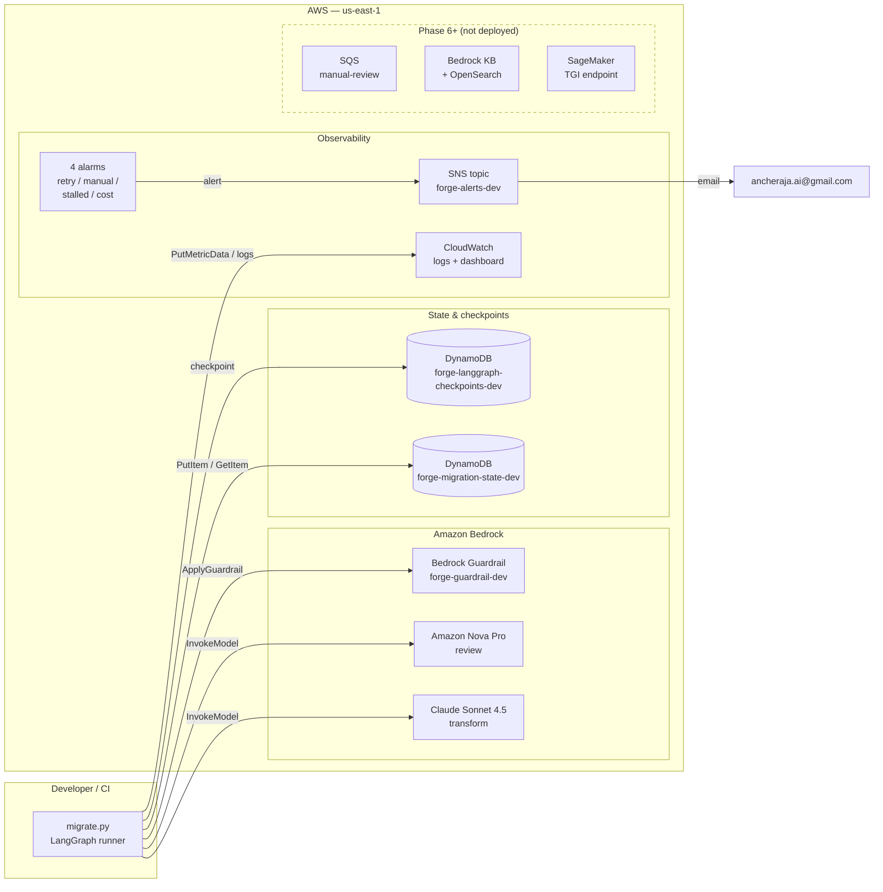
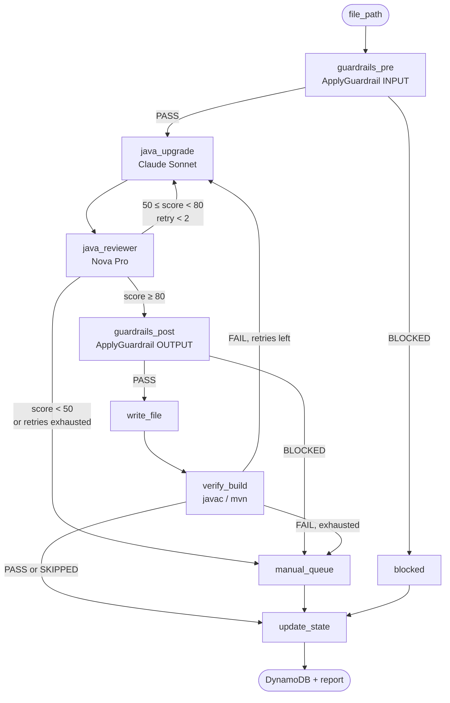

# FORGE

**F**ile-by-file, AI-powered Java migration pipeline. Upgrades legacy Java codebases (`javax.*` → `jakarta.*`, deprecated APIs, Spring Boot versions) using AWS Bedrock, with every file validated by Bedrock Guardrails and cross-reviewed by a second model before it's written.

---

## Architecture



### Pipeline flow (LangGraph)



---

## Repository layout

```
forge-platform/
├── forge-terraform/       AWS infra as Terraform modules
│   ├── modules/
│   │   ├── foundation/    DynamoDB, Bedrock Guardrail, IAM
│   │   ├── observability/ CloudWatch logs/dashboard/alarms, SNS
│   │   ├── sqs/           Phase 6 — manual review queue
│   │   ├── rag/           Phase 6 — OpenSearch + Bedrock KB
│   │   └── sagemaker/     Future — TGI endpoint
│   └── scripts/
│       ├── bootstrap-state.sh         Creates TF state bucket
│       └── generate-agents-yaml.sh    Generates MVP config
│
├── forge-mvp/             Python pipeline (LangGraph + Bedrock)
│   ├── migrate.py         CLI entrypoint (also --ui)
│   ├── agents.yaml        Resource IDs, model IDs, thresholds, pricing
│   ├── forge/
│   │   ├── graph.py       LangGraph wiring
│   │   ├── state.py       TypedDict state + FileStatus
│   │   ├── phases.py      Phase registry — transform prompt + reviewer rubric
│   │   ├── agents/        guardrails_pre/post, java_upgrade
│   │   ├── review/        java_reviewer
│   │   ├── guardrails/    Bedrock ApplyGuardrail wrapper
│   │   ├── verify/        build_verifier — javac / mvn compile gate
│   │   ├── state_store/   DynamoDB checkpointer + state manager
│   │   └── utils/         scanner, writer, report, java_checks,
│   │                      telemetry (CloudWatch), cost (token pricing)
│   └── tests/             300+ tests, fully mocked
│
└── prompts/               Specifications and the pack library
    ├── FORGE-Infra-Terraform.md
    ├── FORGE-Phase0-MVP.md
    ├── FORGE-Platform-Requirements.md   Phase 1 — pack contract, invariants, decisions
    └── packs/                           one technology transition per *.pack.md
```

---

## Quick start

### 1. Deploy Phase 0 infra

```bash
# One-time bootstrap — creates TF state bucket + lock table
bash forge-terraform/scripts/bootstrap-state.sh <aws_account_id>

cd forge-terraform
terraform init \
  -backend-config="bucket=forge-terraform-state-<aws_account_id>" \
  -backend-config="key=forge/dev/terraform.tfstate" \
  -backend-config="region=us-east-1"

cp terraform.tfvars.example terraform.tfvars   # fill in vars
terraform apply -target=module.foundation
terraform apply -target=module.observability
```

### 2. Generate pipeline config

```bash
./forge-terraform/scripts/generate-agents-yaml.sh dev > forge-mvp/agents.yaml
```

### 3. Run the pipeline

```bash
cd forge-mvp
pip install -r requirements.txt

# Run the test suite first — fully mocked, needs no AWS credentials
pytest

# The whole flow from a browser — Project → Discover → Run → Review → Accept → Feedback
python migrate.py --ui

# The pack library, in dependency order (no AWS needed)
python migrate.py --list-packs

# Which packs apply to a repository, with evidence — no AWS needed
python migrate.py /path/to/app --discover

# Dry run against a single file (no writes, no DynamoDB updates, no metrics)
python migrate.py /path/to/java/project --phase java21 --dry-run --file /path/to/Foo.java

# Full run, then the pack's acceptance checks over the merged tree (exit code is the gate)
python migrate.py /path/to/java/project --phase java21 --output-dir ./migrated --acceptance

# Struts 1/2 + Spring 4 + Jackson 1.x codebase (also picks up struts-config.xml)
python migrate.py /path/to/legacy/app --phase struts-spring6 --output-dir ./migrated
```

### Migration phases

| Phase | Scope | Files scanned |
|---|---|---|
| `java21` | Java 8 → 21, `javax.*` → `jakarta.*`, deprecated + date/time APIs | `.java` |
| `struts-spring6` | Struts 1/2 → Spring MVC 6, Spring 4 → 6, Jackson 1 → 2, Java 8 → 21 | `.java`, `struts-config.xml`, `struts.xml`, `validation.xml`, Tiles configs |

The two phases above are built in. Everything else is a **pack** under [prompts/packs/](prompts/packs/) —
one technology transition per file (`javax-to-jakarta`, `struts2-modernize`, `springsec-to-springsec6`,
`webapp-bootstrap-jakarta10`, `liberty-server-config`, …), loaded at startup and accepted by
`--phase`. The contract is [prompts/FORGE-Platform-Requirements.md](prompts/FORGE-Platform-Requirements.md).

### Optional: build verification

A file can score 95 and still not compile. Enable the compile gate in `agents.yaml`:

```yaml
build_verification:
  enabled: true
  mode: "javac"        # javac | maven | command
  classpath: "libs/*"  # javac needs the project's deps to resolve imports
  timeout_seconds: 300
```

A failed compile feeds the compiler errors back to the transform agent as review feedback and
consumes one retry. A missing toolchain is reported as SKIPPED rather than failing the file.

---

## Status

- ✅ **Phase 0 infra** — deployed to AWS account `100769305811` / `us-east-1`
- ✅ **Phase 0 pipeline** — complete, 300+ tests passing (`cd forge-mvp && pytest`, no AWS required)
- ✅ **Observability** — the pipeline now publishes the metrics the CloudWatch alarms and dashboard consume
- ✅ **Build verification** — opt-in `javac`/`mvn` gate; a failed compile retries with the compiler errors
- ✅ **Phases** — `java21` and `struts-spring6` built in; 10 runnable packs on top
- ✅ **Phase 1 packs + `web_bootstrap` extractor** — `web.xml`, vendor descriptors and Liberty `server.xml` migrate with full descriptor context
- ✅ **Discovery + acceptance** — `--discover` profiles any repo and selects packs; `--acceptance` gates the project on mechanical checks
- ✅ **Human in the loop** — risky units are held for review; `migration-review.html` → `decisions.json` → `--apply-decisions`; notes roll up into `pack-feedback.md`
- ✅ **Local web UI** — `python migrate.py --ui`: the same pipeline driven from a browser on your own machine, with live progress and one-click approve / reject / retry
- ⏳ **SNS email confirmation** — pending click in `ancheraja.ai@gmail.com`
- ⏳ **Phase 6+** — SQS, RAG, SageMaker modules exist in Terraform but not deployed

## Cost profile

| Scope | Idle | Active migration |
|---|---|---|
| Phase 0 only (foundation + observability) | ~$5/mo | ~$20–40/mo |
| + `rag` module | +$175/mo (OpenSearch always-on) | same |
| + `sagemaker` (ml.g5.2xlarge) | +$1,093/mo | stop endpoint when idle |

## Specs

- [prompts/FORGE-Infra-Terraform.md](prompts/FORGE-Infra-Terraform.md) — full infrastructure spec
- [prompts/FORGE-Phase0-MVP.md](prompts/FORGE-Phase0-MVP.md) — MVP pipeline spec
- [CLAUDE.md](CLAUDE.md) — working notes for Claude Code sessions
